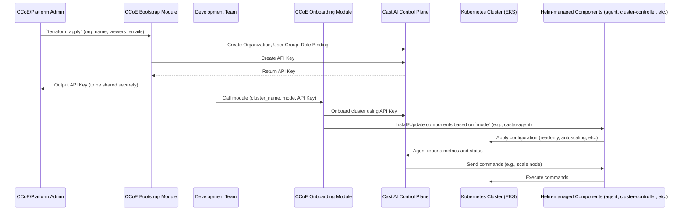

# Cast AI Enablement Architecture

# Responsible for this page

| Date | Person        |
| ---- | ------------- |
|      | Ravin Vasudev |

# Last Review

| Date | Person        |
| ---- | ------------- |
|      | Ravin Vasudev |

---

# Overview

This document proposes a phased architecture for enabling **Cast AI** across Kubernetes clusters using a **centralized Terraform module** owned by the Cloud Center of Excellence (CCoE).

The goal is to:

- Deliver **quick, low-risk value** to development teams
- Abstract Cast AI complexity behind a stable interface
- Enforce **guardrails and safe defaults**
- Enable **progressive adoption** of Cast AI capabilities through explicit opt-in

The architecture follows a **safe-by-default, policy-driven** model aligned with GitOps and platform best practices.

The architecture is implemented using two distinct Terraform modules to enforce separation of concerns between organizational setup and cluster onboarding:

1.  **Bootstrap Module (CCoE-Managed):** A one-time setup module run by the CCoE/Platform team. Its sole responsibility is to provision the Cast AI organizational structure. This includes:
    - Creating the Cast AI Organization.
    - Creating a User Group and populating it with read-only viewers.
    - Creating a Role Binding to grant the User Group `Viewer` access.
    - Generating a dedicated, organization-scoped API key for automation. This key is the critical output that links the bootstrap process to the onboarding process.

2.  **Onboarding Module (Developer-Consumed):** The module consumed by development teams to connect a specific EKS cluster to the pre-configured Cast AI organization. It uses the API key generated by the Bootstrap module to:
    - Register the EKS cluster with Cast AI.
    - Install and configure the `castai-agent` and other necessary components via Helm, based on the selected capability tier (`readonly`, `autoscaling`, `full`).

This two-module approach ensures that CCoE retains control over the organizational and security setup, while development teams can self-service cluster onboarding in a safe and controlled manner.

---

# Design Principles

- **Read-only by default**
- **Explicit opt-in** for any mutating behavior
- **Separation of concerns**
  - Terraform → Cast AI control plane + Helm lifecycle
  - Helm → In-cluster runtime components
- **Tiered capability model**, not feature flags
- **Auditability via Git**
- **Least privilege everywhere**

---

# Phased Enablement Strategy

## Phase 1: Read-Only Mode

### Objectives

- Zero operational risk
- Immediate visibility and recommendations
- Trust-building with development teams
- Establish consistent onboarding

### Capabilities Enabled

- Cluster onboarding to Cast AI
- `castai-agent` installed via Helm in **read-only mode**
- Metrics, insights, and cost visibility
- Autoscaler recommendations (non-actionable)

### Capabilities Explicitly Disabled

- Node provisioning or scaling
- Pod evictions
- Spot instance handling
- Any automated cluster mutation

## Phase 2: Progressive Capability Enablement

### Objectives

- Enable automation when teams are ready
- Maintain strong guardrails
- Allow incremental adoption
- Keep CCoE in control of risk

### Capability Tiers

| Tier          | Capabilities                            | Cast AI Components                                                                                          |
| ------------- | --------------------------------------- | ----------------------------------------------------------------------------------------------------------- |
| `readonly`    | Observe only (Phase 1 default)          | - castai-agent                                                                                              |
| `autoscaling` | Node autoscaling without evictions      | - castai-agent, cluster-controller, pod-pinner, workload-autoscaler                                         |
| `full`        | Autoscaling + evictions + spot handling | castai-agent, cluster-controller, pod-pinner, workload-autoscaler, evictor, spot-handler, kvisor (optional) |

Each tier maps to a **predefined Helm configuration** managed centrally by Terraform.

---

# High-Level Architecture

The Cast AI integration follows a **CCoE-controlled, Terraform-driven architecture** with clear ownership boundaries between platform and application teams.

## Responsibility Breakdown

| Layer                    | Owner                         | Responsibilities                                 |
| ------------------------ | ----------------------------- | ------------------------------------------------ |
| Dev Team Terraform       | App Teams                     | Consume CCoE module, choose capability tier      |
| Cast AI Terraform Module | CCoE                          | Defaults, guardrails, Helm lifecycle, validation |
| Cast AI Control Plane    | CCoE/App Teams                | Optimization logic, recommendations              |
| Kubernetes Runtime       | CCoE (Terraform-managed Helm) | Execution of approved actions                    |

## Key Architectural Decisions

- Terraform is the **single source of truth** for Cast AI enablement
- Helm releases are **centrally managed** by the CCoE module
- Capability tiers gate **which Helm components and permissions exist**
- No direct Cast AI console or manual Helm changes are supported
- Rollback is achieved by reverting Terraform state

## Phase Alignment

| Phase   | Architecture Characteristics               |
| ------- | ------------------------------------------ |
| Phase 1 | Agent installed, read-only, no mutations   |
| Phase 2 | Mode-gated Helm releases enable automation |

## Sequence Diagram



---

# Organization & Access Management

The architecture enforces strict governance over who can access the Cast AI console and what actions they can perform.

Note: These resources are provisioned and managed by the Bootstrap Module.

## Organization Mapping

- One-to-One / Many-to-One: The architecture supports mapping a single cluster or multiple clusters to a dedicated organization controlled by the `organization_name` input.
- Isolation: This ensures logical separation of resources and aligns with billing or business unit boundaries.

## User Access & RBAC

Access to the Cast AI console is managed declaratively via Terraform, avoiding manual user management. Users are assigned to a user group.

### User Groups

- A dedicated User Group is created for the consumers of the module.
- Users are added to this group via the viewers_emails variable.

### Role Bindings

- The User Group is bound to specific Cast AI roles.
- Default Policy: The module binds the group to the Viewer role (Read-Only) by default.
- Principle of Least Privilege: This ensures that even if a user logs into the Cast AI console, they cannot manually trigger actions that Terraform/Helm are supposed to manage (like node deletion or policy changes).

---

# Terraform Module Design

The implementation is split into two separate Terraform modules: bootstrap and onboarding.

## Bootstrap Module

This module is run once per Cast AI organization by the CCoE team. It is responsible for creating the foundational resources in the Cast AI control plane.

## Inputs

### Required

```hcl
aws_region
organization_name
viewers_emails
```

## Outputs

```hcl
org_id
```

## Onboarding Module

This module is consumed by development teams to connect an EKS cluster to the organization created by the bootstrap module.

Note: org_api_key is available through AWS SSM parameter store.

## Inputs

### Required

```hcl
cluster_name
aws_region
```

### Optional

```hcl
enable_castai = true # default
castai_mode = "readonly" # default
delete_nodes_on_disconnect = true # default
```

### Defaults

| Setting               | Default    |
| --------------------- | ---------- |
| Cast AI mode          | `readonly` |
| Agent install         | Enabled    |
| Agent behavior        | Read-only  |
| Autoscaling           | Disabled   |
| Evictions             | Disabled   |
| Spot handling         | Disabled   |
| Environment overrides | None       |

## Outputs

```hcl
cluster_name
castai_mode
castai_enabled_components
```

---

## Helm Release Management (Phase 2)

### Terraform-managed via Helm Components

All Helm releases are managed by the **Onboarding Module**, with behavior gated by the `castai_mode` variable.

In Phase-2, it’s reasonable for Terraform to manage:

| Component           | Notes                         |
| ------------------- | ----------------------------- |
| cluster-controller  | `autoscaling` and `full` mode |
| pod-pinner          | `autoscaling` and `full` mode |
| workload-autoscaler | `autoscaling` and `full` mode |
| evictor             | `full` mode only              |
| spot-handler        | `full` mode only              |
| kvisor              | `full` mode only              |

### Ownership Model

| Responsibility  | Owner                |
| --------------- | -------------------- |
| Helm lifecycle  | Terraform (CCoE)     |
| Helm values     | CCoE only            |
| Version pinning | CCoE                 |
| Enablement      | Dev teams (via mode) |

**Note:** Teams cannot supply custom Helm values.

### Capability Mapping (Internal)

```hcl
locals {
  castai_capabilities = {
    readonly = {
      agent          = true
      autoscaling    = false
      evictions      = false
      spot_instances = false
      kvisor         = false
    }

    autoscaling = {
	    agent          = true
      autoscaling    = true
      evictions      = false
      spot_instances = false
      kvisor         = false
    }

    full = {
      agent          = true
      autoscaling    = true
      evictions      = true
      spot_instances = true
      kvisor         = true
    }
  }

  capabilities = local.castai_capabilities[var.castai_mode]
}
```

### Helm Release: castai-agent

```hcl
resource "helm_release" "castai_agent" {
  count = var.enable_castai ? 1 : 0

  name             = "castai-agent"
  repository       = "https://castai.github.io/helm-charts"
  chart            = "castai-agent"
  namespace        = "castai-agent"
  create_namespace = true
  cleanup_on_fail  = true

  values = [
    yamlencode({
      readOnly = var.castai_mode == "readonly"

      autoscaling = {
        enabled = local.capabilities.autoscaling
      }
    })
  ]

  set = concat(
    [
      {
        name  = "provider"
        value = "eks"
      },
      {
        # Required until https://github.com/castai/helm-charts/issues/135 is fixed.
        name  = "createNamespace"
        value = "false"
      },
      {
        name  = "apiURL"
        value = local.castai_api_endpoint
      },
      {
        name  = "cluster_id"
        value = castai_eks_clusterid.this[0].id
      }
    ]
  )

  set_sensitive = [
    {
      name  = "apiKey"
      value = castai_eks_cluster.this[0].cluster_token
    },
  ]

  lifecycle {
    prevent_destroy = true
  }
}
```

**Why `prevent_destroy = true`?**

- Prevents accidental agent removal
- Forces intentional teardown
- Reduces prod blast radius

---

# Guardrails & Validation

## Mode Validation

- Invalid combinations fail at `terraform plan`
- No evictions allowed outside `full` mode
- No autoscaling in `readonly`

## Environment-Based Restrictions

| Environment | Allowed Modes         |
| ----------- | --------------------- |
| dev         | all                   |
| staging     | readonly, autoscaling |
| prod        | readonly by default   |

Production upgrades require explicit approval.

---

# Terraform Destroy Strategy

- `prevent_destroy = true` for agent
- Full teardown requires:

```hcl
allow_castai_destroy = true
```

This avoids accidental production outages.

```hcl
lifecycle {
  prevent_destroy = var.allow_castai_destroy == false
}
```

---

# Security & Risk

## IAM & RBAC

- Phase 1:
  - Read-only Kubernetes RBAC
    - No EC2 modification permissions
- Phase 2:
  - Scoped IAM role
    - Node group management
    - Instance lifecycle
  - Environment-bound permissions
  - Least-privileged policies

## Kubernetes RBAC

- `castai-agent` runs in a dedicated namespace
- Uses service accounts with:
  - Read-only access in Phase 1
  - Scoped write access only when required
- No access to application secrets

## Risk Assessment

| Risk                | Phase 1 | Phase 2    |
| ------------------- | ------- | ---------- |
| Pod disruption      | None    | Controlled |
| Cluster instability | None    | Managed    |
| Security exposure   | Minimal | Managed    |
| Cost Impact         | None    | Positive   |

## Operational Risks & Mitigations

### Risk: Unintended Pod Evictions

- **Mitigation**
  - Disabled by default
  - Enabled only in `full` mode
  - Requires workload readiness (PDBs, replicas)

### Risk: Over-aggressive Scaling

- **Mitigation**
  - Opinionated autoscaling limits
  - Environment-based caps
  - No per-team overrides

### Risk: Terraform Destroy Impact

- **Mitigation**
  - Agent lifecycle decoupled from infra
  - No implicit Helm deletions
  - Explicit teardown required

## Incident & Rollback

- Revert `castai_mode` to `readonly`
- Helm releases reconcile safely
- No cluster recreation required
- Agent remains installed but read only

---

# Ownership Model

## CCoE Responsibilities

- Terraform module
- Helm lifecycle
- Defaults and guardrails
- Policy enforcement
- Version control

## Dev Teams Responsibilities

- Choosing what to opt in
- Ensuring workload readiness
- Accepting operational impact
- Raising change requests for higher tiers

---

# Non-Goals

- Per-team Helm overrides
- Arbitrary Cast AI policy overrides
- Runtime toggles outside Git
- Direct Cast AI console changes
- Bypassing Terraform module

---

# Success Criteria

- Zero incidents during Phase 1
- Consistent onboarding across teams
- Measurable cost insights delivered
- Controlled, auditable feature adoption
- No platform bypass

---

# Implementation Plan

## Phase 1 – Foundational Setup & Read-Only Rollout

1.  **Build Bootstrap Module:** Create the Terraform module to manage Cast AI organizations, user groups, and API keys.
2.  **Build Onboarding Module (Read-Only):** Develop the core onboarding module. Initially, it will only support `readonly` mode.
3.  **Helm Integration:** Configure the onboarding module to install the `castai-agent` in read-only mode via a managed Helm release.
4.  **Pilot Onboarding:** Use the bootstrap module to create a pilot organization. Onboard pilot EKS clusters using the onboarding module in `readonly` mode.
5.  **Gather Feedback:** Collect feedback from pilot teams and validate cost insights and recommendations.

## Phase 2 – Capability Rollout

1.  **Enhance Onboarding Module:** Introduce the tiered `castai_mode` variable (`readonly`, `autoscaling`, `full`).
2.  **Implement Guardrails:** Add validation rules and policy enforcement based on the selected mode and environment.
3.  **Enable Autoscaling Mode:** Update the Helm release logic within the onboarding module to enable the `cluster-controller` and other components for the `autoscaling` tier.
4.  **Enable Full Mode:** Add support for the `evictor` and `spot-handler` components for the `full` tier.
5.  **Documentation:** Document workload readiness requirements (e.g., PDBs) for teams opting into `full` mode.
6.  **Gradual Expansion:** Roll out the new capabilities to teams in a controlled manner.

---

# Summary

This architecture:

- Delivers fast value with no risk in phased manner
- Enables controlled automation
- Aligns with Terraform and Kubernetes best practices
- Scales across teams and multiple environments

Cast AI becomes a **trusted, governed platform capability**, not an uncontrolled optimizer.

---

# Change Log

| Date | Version | Update          | Author        |
| ---- | ------- | --------------- | ------------- |
|      | 1.0     | Initial Version | Ravin Vasudev |
